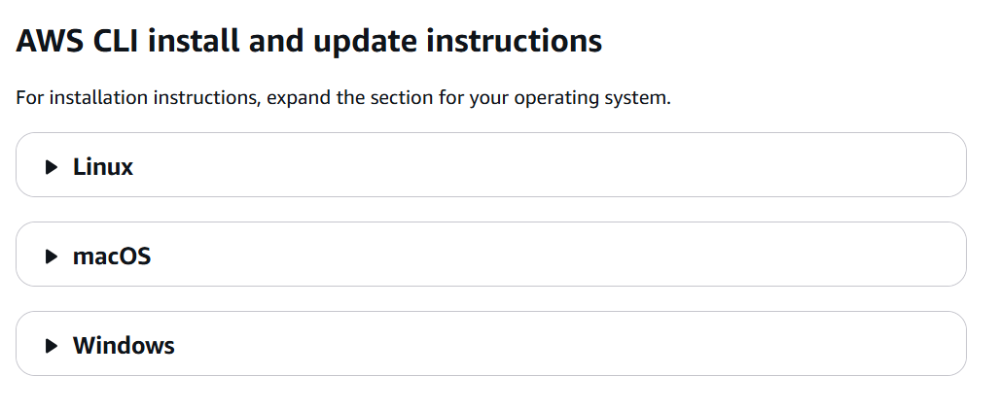
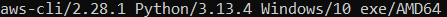
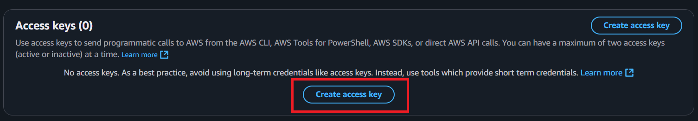
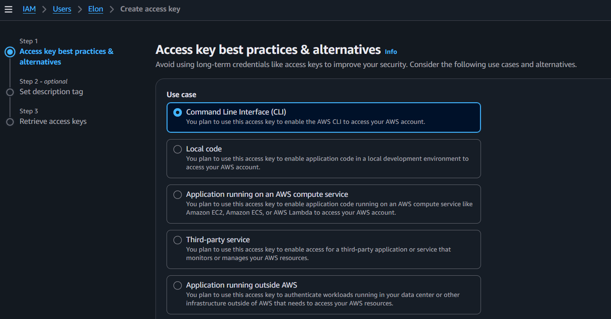
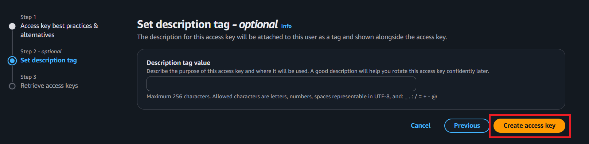
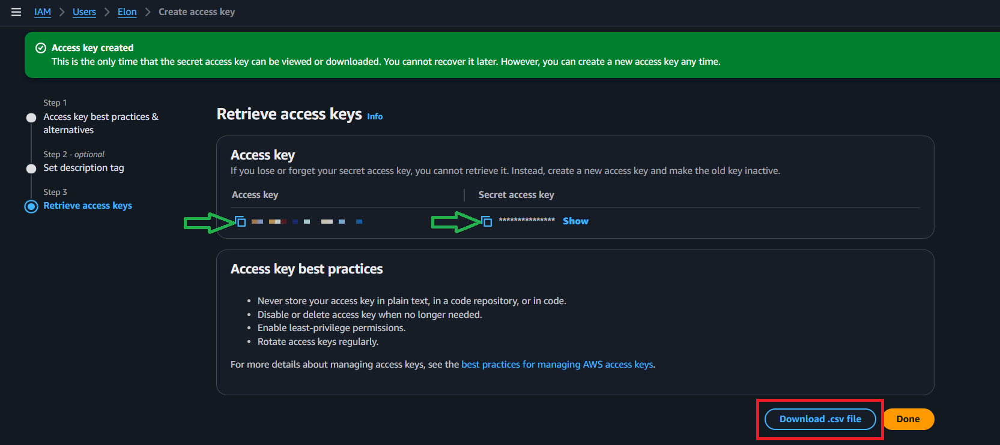
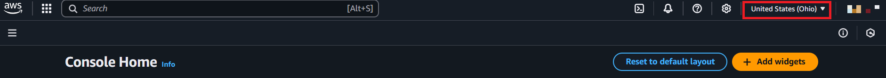
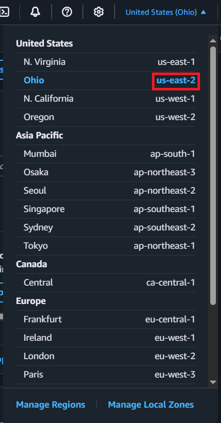
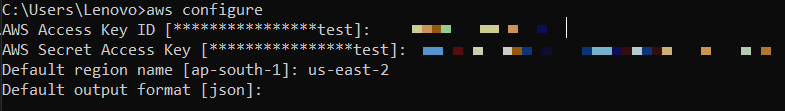
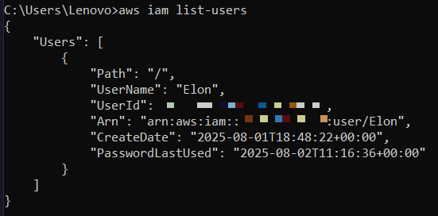

# 🛠️ AWS CLI Setup & IAM Access Key Configuration

This guide helps you install and configure the AWS CLI on Windows/macOS/Linux, create IAM access keys, and verify your setup by listing users via command line.

---

## 📦 Step 1: Install AWS CLI

🔗 [Official AWS CLI Installation Guide](https://docs.aws.amazon.com/cli/latest/userguide/getting-started-install.html)

### 📍 Select your OS



### 💾 Download & Install

| OS          | Installer / Command                                          |
| ----------- | ------------------------------------------------------------ |
| **Windows** | [Download `.msi`](https://awscli.amazonaws.com/AWSCLIV2.msi) |
| **macOS**   | [Download `.pkg`](https://awscli.amazonaws.com/AWSCLIV2.pkg) |
| **Linux**   | See below ↓                                                  |

#### 🐧 Linux Installation (Manual)

```bash
# Remove old version (optional)
sudo yum remove awscli

# Download AWS CLI v2
curl "https://awscli.amazonaws.com/awscli-exe-linux-x86_64.zip" -o "awscliv2.zip"

# Unzip and install
unzip awscliv2.zip
sudo ./aws/install
```

📘 [Full Linux Install Guide →](https://docs.aws.amazon.com/cli/latest/userguide/install-cliv2-linux.html)

## Step 2: Verify installation

> aws --version

If you get output like below then aws cli is successfully installed in your system.



## 🔑Step 3: Create IAM Access Key

1. Navigate to: IAM → Users → Select a User → Security Credentials tab → Access Keys → Create Access Key



If we want to call AWS from AWS CLI, AWS Tools for PowerShell, AWS SDKs, or direct AWS API calls, we need Access Key.

2. Select a Use Case



Select a use case where you are going to use this Access Key, then select the confirmation and click on Next

3. Click on Create Access Key Button



4. 📂 Retrieve Access Key

You’ll receive: Access Key ID, Secret Access Key

Options: Copy manually
OR click Download .csv



## Step 4: Configure AWS CLI

You’ll be prompted to enter:

```
AWS Access Key ID: YOUR_ACCESS_KEY
AWS Secret Access Key: YOUR_SECRET_KEY
Default region name: us-east-1
Default output format: json
```

🌍 Get Region Name
On AWS Console → Home → Click region dropdown (top-right corner near username)




Now in Cmd or Terminal add the command `aws configure`



## 🧪 Step 5: Test Your Configuration

`aws iam list-users`

If configured correctly, you’ll see output like:



## 📘 Summary

| Task                            | Status |
| ------------------------------- | ------ |
| Installed AWS CLI               | ✅     |
| Created IAM Access Key          | ✅     |
| Configured with `aws configure` | ✅     |
| Tested with `list-users`        | ✅     |

## 🔐 Pro Tips

Never expose your Secret Access Key publicly

Use .env or environment variables in real projects

Prefer IAM roles over long-term access keys in production
