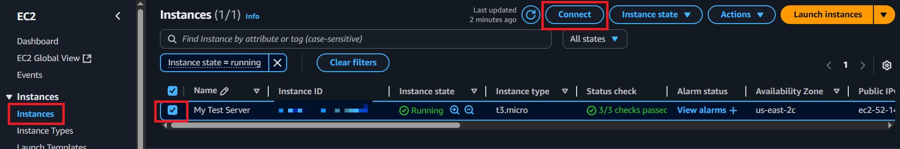
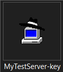
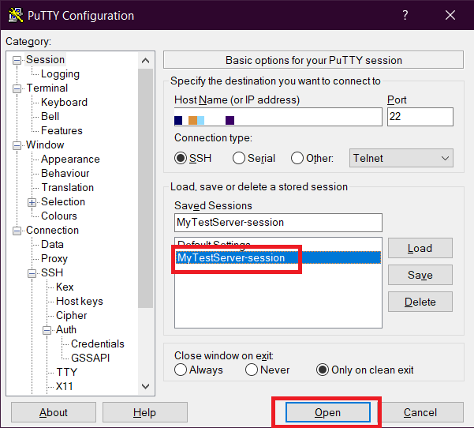
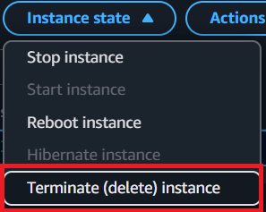

# AWS EC2 Service

**EC2 (Elastic Compute Cloud)** is an AWS service that provides virtual servers (called instances) for hosting applications. It is region-based and ideal for deploying scalable applications, learning Linux, hosting websites, and more.

---

## 🚀 Launching an EC2 Instance

### Step 1: Click on "Launch Instance" button


### Step 2: Provide a name for the instance


### Step 3: Choose an AMI (Amazon Machine Image)

> AMI: Amazon Machine Image is a pre-configured template for your instance.

Select **Amazon Linux AMI**, which is Free Tier eligible.


### Step 4: Select Instance

> Instance = Virtual server

Choose the default free-tier eligible t2.micro instance.


### Step 5: Create New Key Pair

Click **Create new key pair**, add a name, and download the `.pem` file.


### Step 6: Allow HTTP Traffic from the Internet

To make your instance accessible via a browser, enable HTTP in the firewall settings.


### Step 7: Add User Data Script (Optional)

To auto-install Apache and serve a simple HTML page, go to **Advanced Details → User data**, and paste:

```
sudo yum update -y
sudo yum install -y httpd
sudo systemctl start httpd
sudo systemctl enable httpd

echo "<html><h1>Hello World</h1></html>" > /var/www/html/index.html
```


### Step 8: Click on "Launch Instance"


### Step 9: View Running Instance


Open the public IP in your browser.
If https:// doesn't work, try http://


## 🔐 Configure Security Group

### Step 1: Go to Instance → Security Tab → Click on Security Group Link


### Step 2: Click "Edit Inbound Rules"


### Step 3: Delete HTTP Rule (Optional – To See What Happens)


Now, accessing the public IP will show an error:


### Step 4: Re-Add HTTP Rule

Click "Add Rule" → Select Type: HTTP → Save


Your site should now be accessible again:


## 🧑‍💻 Connect to EC2 Remotely

## ✅ Option 1: EC2 Instance Connect (Browser-Based)

### Step 1: Go to EC2 → Select Instance → Click "Connect"



A browser-based Linux shell will open:


### Step 2: Modify HTML Page

```
$ cd /var/www/html
$ ls
$ sudo nano index.html
```


Press Ctrl + O → Enter (Save)

Press Ctrl + X (Exit)


Press `Ctrl` + `O`, click `Enter` to save the file, and `Ctrl` + `X` to exit the nano file editor

Changes are now visible:


## ✅ Option 2: SSH Client (Windows - PuTTY)

### Step 1: Download [Putty](https://apps.microsoft.com/detail/xpfnzksklbp7rj?hl=en-US&gl=US)

### Step 2: Open PuTTYgen from Start Menu


### Step 3: Load the .pem File You Downloaded Earlier


Set file picker to All Files:


Select the PEM file:


### Step 4: Save the Private Key (.ppk)




### Step 5: Open PuTTY → SSH → Auth → Browse .ppk File


### Step 6: Paste the EC2 Public IPv4 Address


### Step 7: Save and Open the Session




### Step 8: Login as ec2-user


## 🗑️ Terminate EC2 Instance

> 💡 If you're using EC2 only for testing, terminate the instance to avoid charges.




---

## ✅ Summary

- Launch and configure an EC2 instance
- Allow public access via HTTP
- Connect using EC2 Instance Connect or PuTTY
- Automate setup with User Data
- Safely terminate the instance

---

> 🧠 This README serves as proof-of-practice and demonstrates hands-on understanding of AWS EC2.
