# 🔐 AWS IAM User Lab

## 📘 Summary

This lab demonstrates how to create a custom IAM user in AWS with specific permissions and set up MFA (Multi-Factor Authentication).  
IAM (Identity and Access Management) enables secure access control by allowing you to create users, assign permissions, group users, and enforce MFA.

---

## 🛠️ Steps Performed to Create a User

### 1. Navigate to the IAM Users section

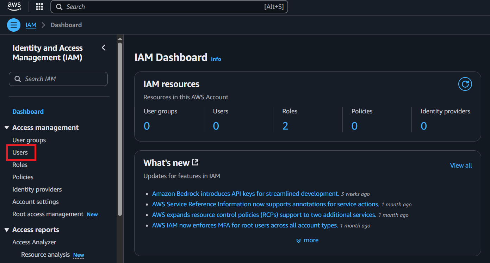

### 2. Click on the **“Create User”** button

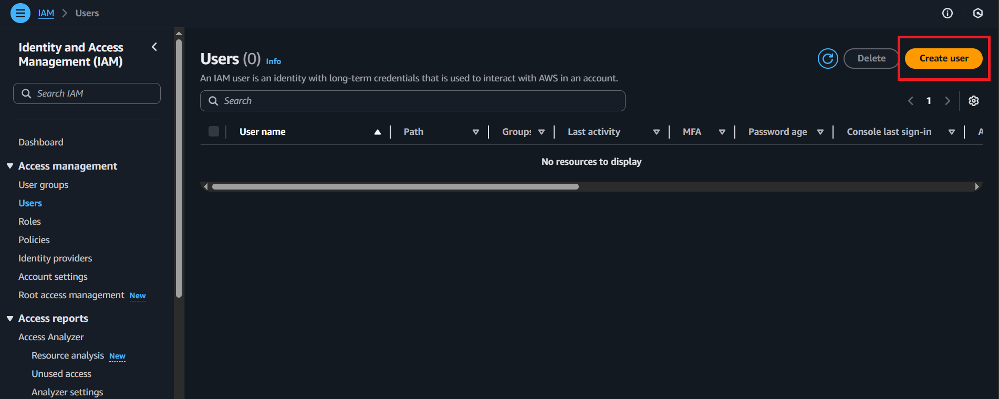

### 3. Specify User Details

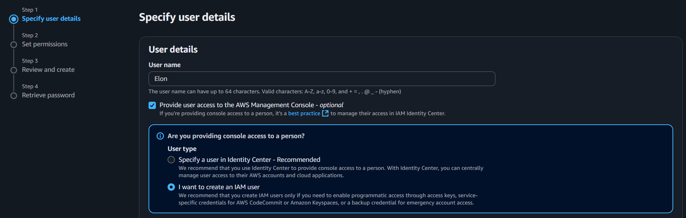

- Entered a username
- Enabled **“Provide user access to the AWS Management Console”**
- Selected **“I want to create an IAM user”**

### 4. Click **Next**

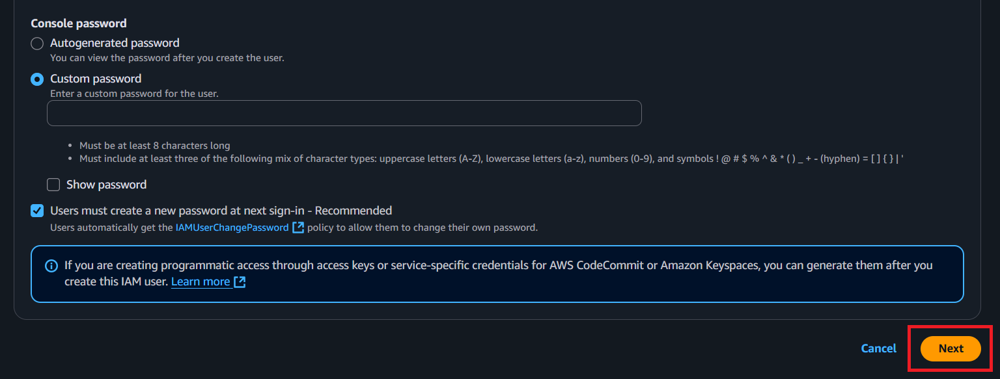

---

## 🔑 Set Permissions

### 5. Choose a Permission Setting

- Selected **“Add user to group”** (easier for managing multiple users)
- Clicked **“Create group”**

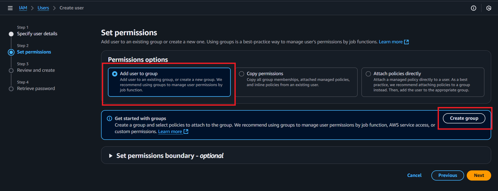

### 6. Create User Group

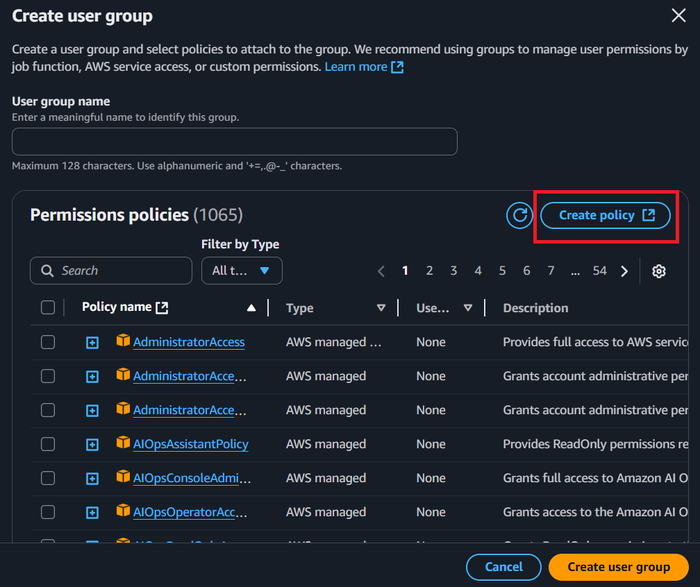  
You can choose from existing policies or create a custom one using the **“Create policy”** button.

---

## 🧾 Create Custom Policy

### 7. Define Permissions via JSON

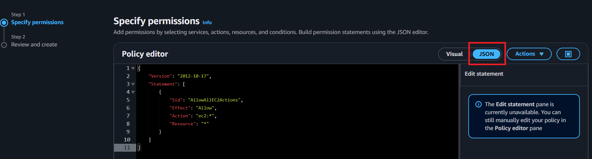

- Used the JSON editor to allow **all EC2 actions**
- Clicked **Next**

### 8. Review and Create

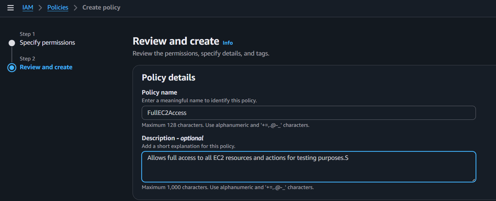

- Entered a policy name and description
- Clicked **Create policy**

---

### 9. Finish Creating the User Group

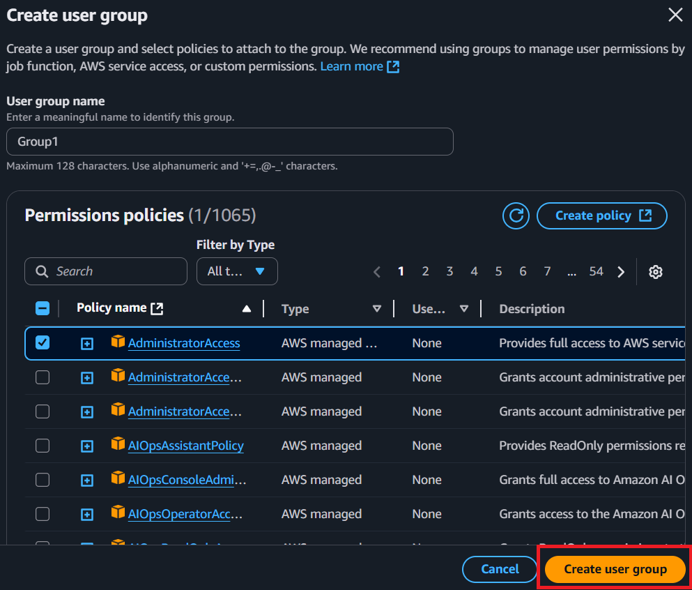

- Selected the custom policy
- Added it to the new group

### 10. Finalize User Creation

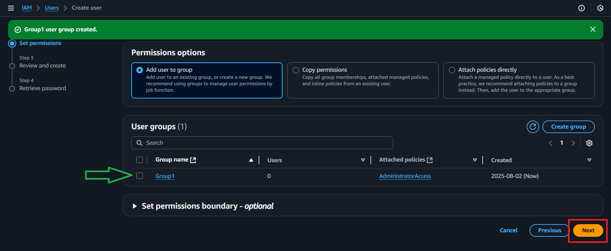

- Clicked **Next**, reviewed the configuration, and clicked **Create user**

### ✅ 11. User Created Successfully

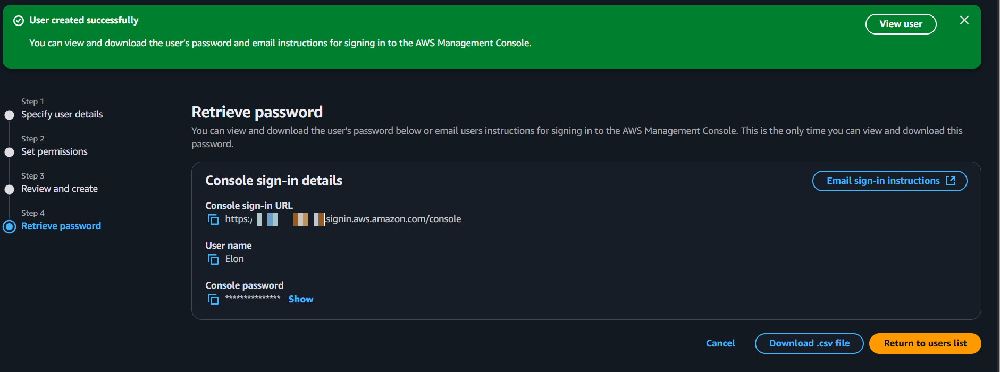

---

## 🔗 Accessing IAM User Console

### 12. Open the User

### 13. Click the Username

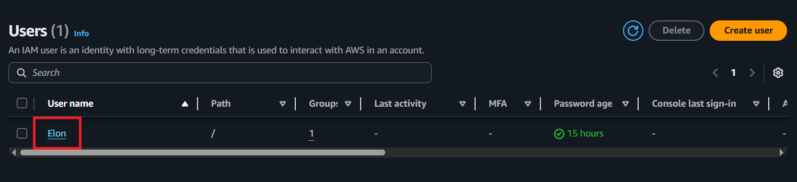

### 14. Go to the **Security Credentials** Tab

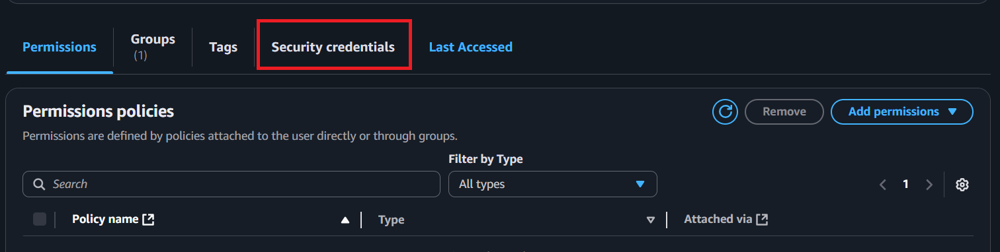

### 15. Copy the Console Sign-In Link

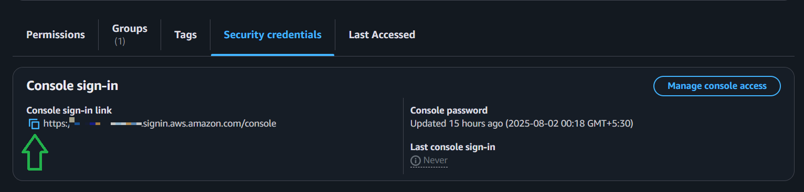

- Opened the link in a new tab
- Logged in using the username (e.g., **Elon**) and password

---

## 🔐 Enable MFA for the User

### 1. Go to IAM → Users

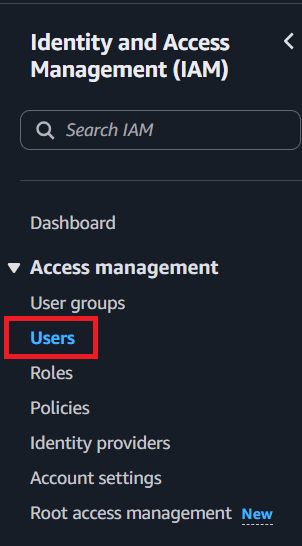

### 2. Open the **Security Credentials** Tab

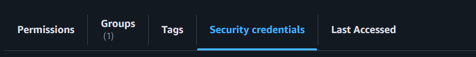

### 3. Click **Assign MFA**

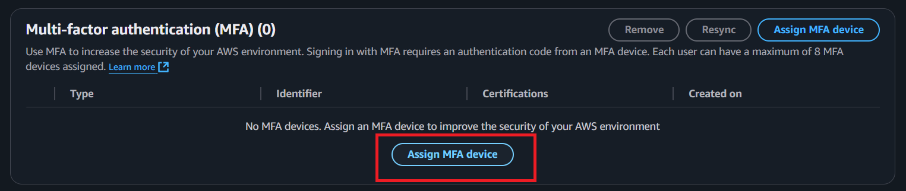

### 4. Choose MFA Device Type

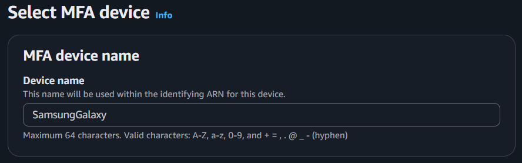  
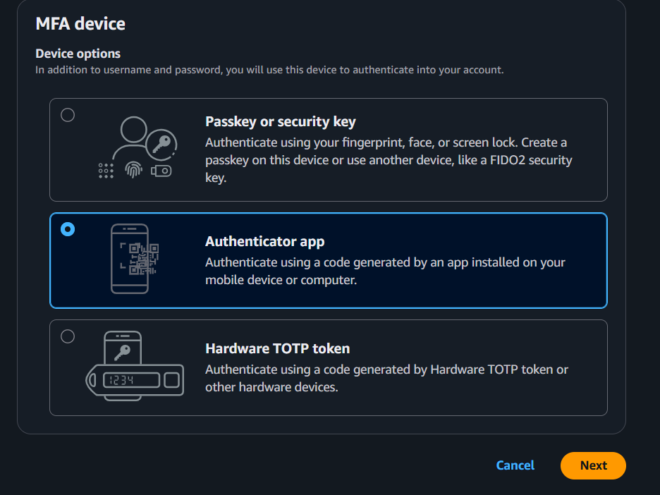

- Entered a device name (can be anything)
- Selected **“Authenticator app”**
- Clicked **Next**

### 5. Complete MFA Setup

- Scanned the QR code using **Google Authenticator**
- Entered **two consecutive MFA codes**
- Clicked **Assign MFA**

---

## ✅ Summary

- Created a new IAM user with group-based permissions
- Designed a custom IAM policy for full EC2 access
- Enabled AWS Console sign-in
- Configured MFA using Google Authenticator

---

> 🧠 This README serves as proof-of-practice and demonstrates hands-on understanding of AWS IAM fundamentals.
